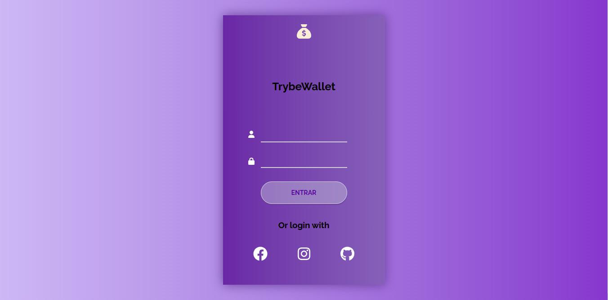
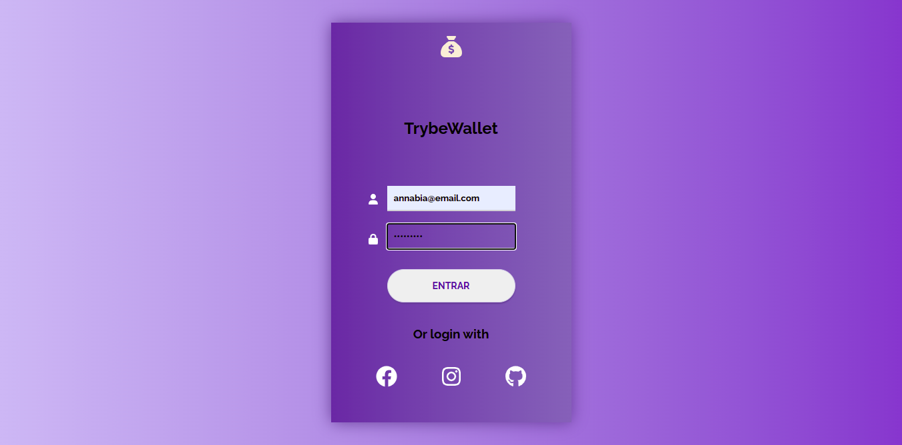
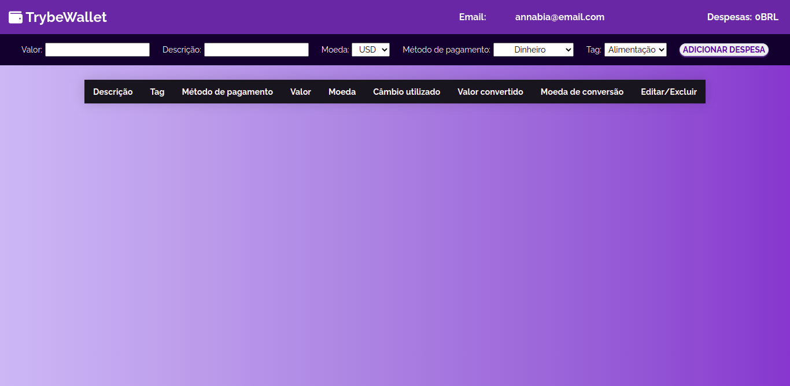
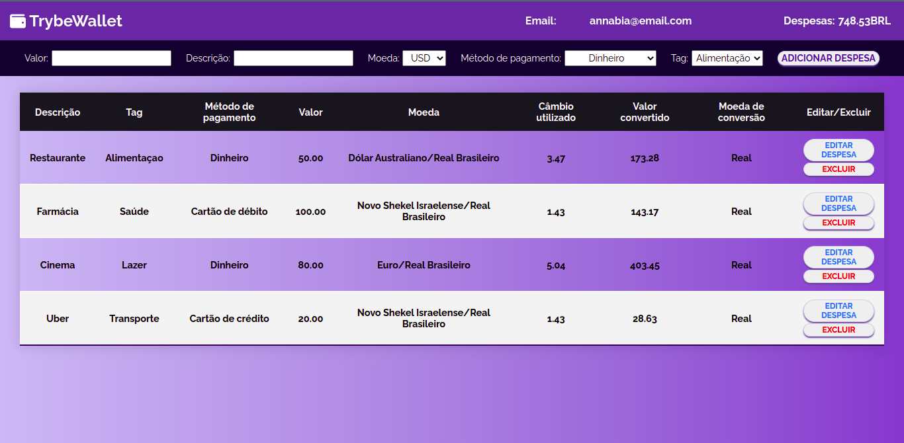

Este projeto contém os requisitos realizados por _[Anna Beatriz Garcia Trajano de Sá](www.linkedin.com/in/anna-beatriz-trajano-de-sá)_ enquanto estudava na [Trybe](https://www.betrybe.com/) :rocket:

# Project TrybeWallet

Neste projeto desenvolvi uma carteira de controle de gastos com conversor de moedas. Ao utilizar essa aplicação um usuário deverá ser capaz de:

 - Adicionar, remover e editar um gasto;
 - Visualizar uma tabelas com seus gastos;
 - Visualizar o total de gastos convertidos para uma moeda de escolha;

Veja o exemplo a seguir do layout do projeto!

## Layout

Login Page 1             |  Login Page 2
:-------------------------:|:-------------------------:
  |  

Wallet Page 1             |  Wallet Page 2
:-------------------------:|:-------------------------:
  |  

 ## Link para o deploy:
 
 [TrybeWallet](https://project-trybewallet2.vercel.app/) 

## Habilidades Desenvolvidas

Neste projeto, desenvolvi as seguintes habilidades:

 - Criar um store Redux em aplicações React
 - Criar reducers no Redux em aplicações React
 - Criar actions no Redux em aplicações React
 - Criar dispatchers no Redux em aplicações React
 - Conectar Redux aos componentes React
 - Criar actions assíncronas na sua aplicação React que faz uso de Redux.
 
 ## Referências
 [Redux Fundamentals](https://redux.js.org/tutorials/fundamentals/part-1-overview) 
 [Redux DevTools](https://chrome.google.com/webstore/detail/redux-devtools/lmhkpmbekcpmknklioeibfkpmmfibljd?hl=pt-BR) 
 [Desvendando o Redux na prática](https://www.youtube.com/watch?v=u99tNt3TZf8) 
 [Font Awesome](https://fontawesome.com/v5/search) 

## Escopo do Projeto

Página de Login

 - Crie uma página inicial de login.

Página da Carteira

Configurando sua página
 - Crie uma página para sua carteira.
 - Crie um header para a página de carteira.

Formulário de adição de Despesa
 - Implemente a lógica para armazenar no estado global as siglas das moedas que vêm da API.
 - Desenvolva um formulário para adicionar uma despesa.
 - Salve todas as informações do formulário no estado global.

Tabela de Gastos
 - Desenvolva uma tabela com os gastos.
 - Implemente a lógica para que a tabela seja alimentada pelo estado da aplicação.
 - Crie um botão para deletar uma despesa da tabela.
